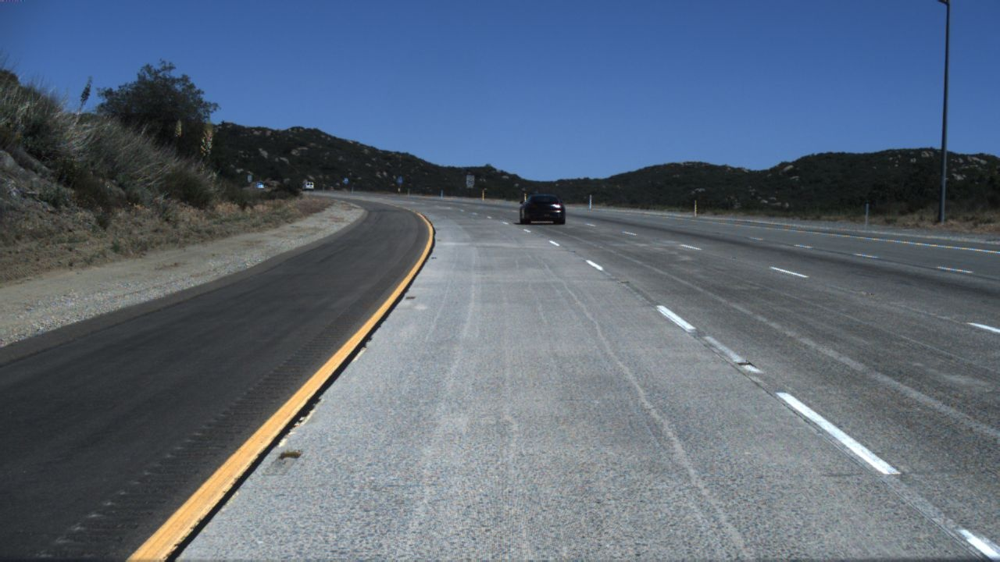

# Image-Anomaly
Repo for detecting Anomalies in Images.

Anamoly here is a very losse open ended term which can means for example if we see some dataset which is "out of ordinary" it can be out of domain data, camera failure, gaussian noise, foreign objects e.t.c

We mainly Implement two Methods for Image Anamoly Detection for both of the methods we first train an autoencoder to map the image to higher level representation and

1) Detect Anamoly based on Reconstruction loss of Autoencoder
2) Fit multinomial gaussian/ KDE on latent variable and find the anamly based on PDF

## Examples

1) Suppose we trained our models on US highway dataset and want to see if their is a domain shift e.g same models implemented on Indian roads we would want to detect that there is anamoly. See the example below

  
&nbsp; &nbsp; &nbsp; &nbsp;
  

