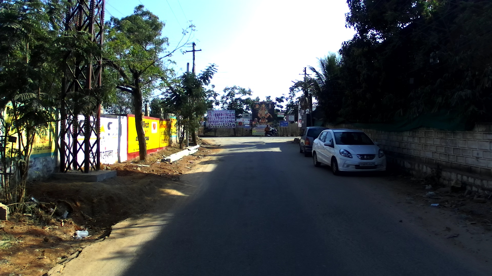

# Image-Anomaly
Repo for detecting Anomalies in Images.

Anamoly here is a very losse open ended term which can means for example if we see some dataset which is "out of ordinary" it can be out of domain data, camera failure, gaussian noise, foreign objects e.t.c

We mainly Implement two Methods for Image Anamoly Detection for both of the methods we first train an autoencoder to map the image to higher level representation and

##Reconstruction based

Detect Anamoly based on Reconstruction loss of Autoencoder

##Kernel Density based
LAKE Model

Fit multinomial gaussian/ KDE on latent variable and find the anamly based on PDF

## Examples

1) Suppose we trained our models on US highway dataset and want to see if their is a domain shift e.g same models implemented on Indian roads we would want to detect that there is anamoly. See the example below

  
&nbsp; &nbsp; &nbsp; &nbsp;
  

## General Tips

1. Donot use any mean and std transformation on training images. Important for constant images like completely white or black
2. Use Sigmoid as last layer to restrict output between 0 and 1
3. Use Nearest interpolation for resizing can effect max and min values a lot if using bilibear or cubic interpolation.
4. Donot use cosine similarity metric as proposed in LAKE on images as images which can vary immensely can have very high cosine similarity metric