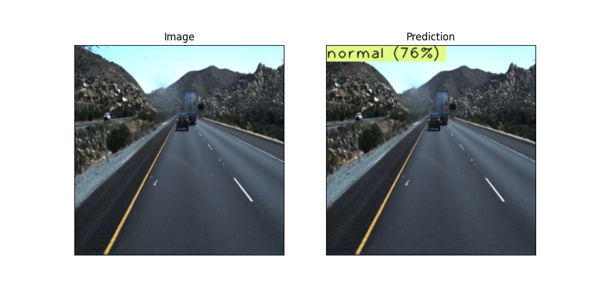

# Image-Anomaly
Repo for detecting Anomalies in Images. We mainly focus on image classification based anamoly but segemntaiton based anamoly is also possible

Anamoly here is a very losse open ended term which can means for example if we see some dataset which is "out of ordinary" it can be out of domain data, camera failure, gaussian noise, foreign objects e.t.c


We mainly Implement two Methods for Image Anamoly Detection for both of the methods we first train an autoencoder to map the image to higher level representation and

## Reconstruction Based
Detect Anamoly based on Reconstruction loss of Autoencoder/VAE

## Kernel Density Based
LAKE Model
Fit multinomial gaussian/ KDE on latent variable and find the anamoly based on PDF with some modifications

# Using Anomalib Library

To Train DfKDM model

```
python tools/train.py --config anomalib/models/dfkdm/config.yaml   

```

Results are saved in results directory

To perform inference on using trained model
use infer.ipynb notebook


DfKDM for bottle dataset acheived F1 score  of __92.7%__
where normal is with no defects
<p align="center">
  
&nbsp; &nbsp; &nbsp; &nbsp;
  
</p>
<p align="center">
  
&nbsp; &nbsp; &nbsp; &nbsp;
  
</p>

DfKDM for Driving dataset F1 score of __94%__
Where normal is defined as highway driving
<p align="center">
  
&nbsp; &nbsp; &nbsp; &nbsp;
  
</p>
<p align="center">
  
&nbsp; &nbsp; &nbsp; &nbsp;
  
</p>


## General Tips

1. Use Sigmoid as last layer to restrict output between 0 and 1
2. Donot use cosine similarity metric on raw images as images can vary immensely can have very high cosine similarity metric


References:

1.https://github.com/openvinotoolkit/anomalib
