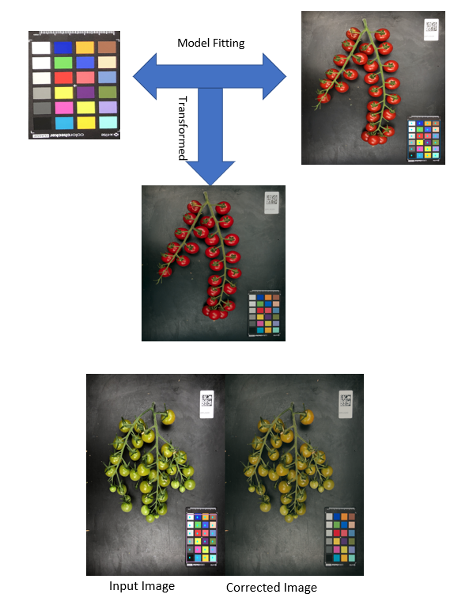

The second preporocessing of image during image capture is color calibration

Color calibration is the process of adjusting the colors in an image to a known standard (gold standard of colors). In vegetable phenotyping, color calibration may be used to improve the accuracy and consistency of measurements and analyses that are based on the color of the vegetables.There are several approaches to color calibration that can be used in vegetable phenotyping but the one we utilize is the using color calibration target. A color calibration target is a physical object with a known set of colors. By placing the calibration target in the field of view of the camera and taking an image of it, the colors in the image can be adjusted to match the known colors on the target. This is used for ensuring consistent and accurate color measurements across different images. It is important to ensure the lighting conditions of the images when capturing them for vegetable phenotyping
We wrote the color calibration from scratch as the currently existing open source implementations didnot produce reasonbly good results.

<figure markdown>
  { align=left }
  <figcaption>Color calibration process</figcaption>
</figure>

!!! note annotate "Note!"
    Color calibration is not the same as light correction or histogram equalization. Infact the prerequisite to have good color calibration is to have uniform lightining across the whole workspace

!!! note annotate "Note!"
    Color calibration is part of image ingestion software in Scalecam.