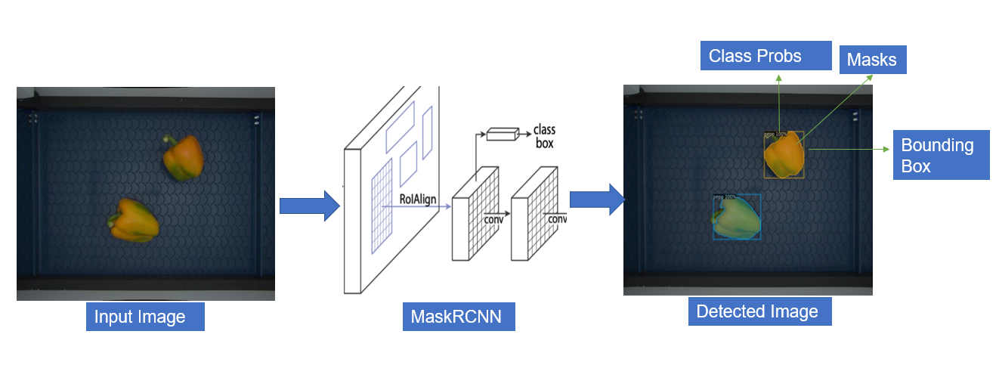

We use MaskRCNN for detection and instance segemetation. Brief summary of the network is

Mask R-CNN is a convolutional neural network (CNN) architecture for object detection and instance segmentation. It was introduced in the 2017 paper "Mask R-CNN" by Kaiming He, Georgia Gkioxari, Piotr Dollar, and Ross Girshick.
The Mask R-CNN architecture extends the Faster R-CNN architecture by adding a branch for predicting an object mask in parallel with the branch for predicting object bounds. The mask branch is a fully convolutional network that takes the region of interest (RoI) features as input and outputs a binary mask indicating the presence or absence of each class of object.
One of the key features of Mask R-CNN is its ability to handle objects of arbitrary size and shape, thanks to its use of RoIAlign, which allows the network to accurately align the mask predictions with the input image. This makes it well-suited for tasks such as instance segmentation and panoptic segmentation.
Mask R-CNN has been widely used in a variety of applications, including object detection, image segmentation, and video analysis. It has also been extended to other tasks such as keypoint detection and multi-label classification.
See [MaskRCNN](https://arxiv.org/abs/1703.06870) for more details.

We use detectron2 library for MaskRCNN but we have added additional features in detectron2 library

**Added Features** :fire:

1. Added multiple deconv layers in maskrcnn **MaskHead** which are configurable via config file.

2. Added optimal anchors calculation based on dataset.

3. Improved training loop and trainers for logging and visualization during training inlcuding FLOPs calculation of models.

4. Added Weights&Biases logging for tracking experiments.

<figure markdown>
  { align=left }
  <figcaption>Instance segementation</figcaption>
</figure>