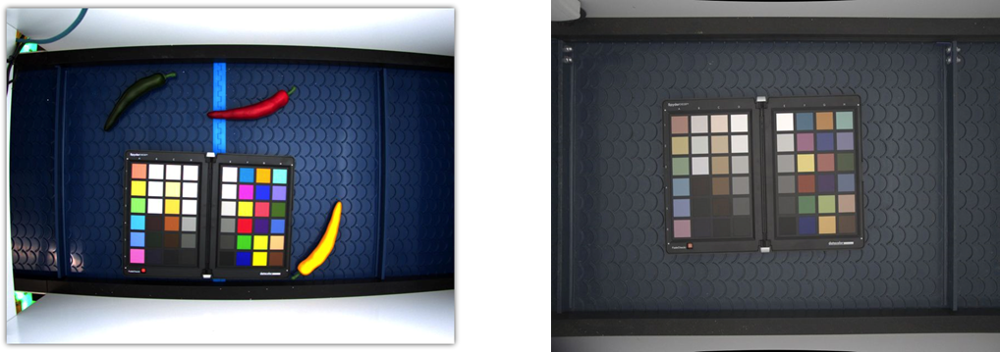

# Image calibration

The Image calibration process is used to identify the distortion of image and apply distortion corrections.

The checkerboard method is a method for calibrating the intrinsic and extrinsic parameters of a camera using a series of images of a checkerboard pattern. The checkerboard pattern is a flat object with a regular pattern of black and white squares, arranged in a grid. The checkerboard pattern is placed in the field of view of the camera, and a series of images is taken at different angles and positions.

To calibrate the camera using the checkerboard method, the following steps are typically followed:

1. Print out or create a digital version of the checkerboard pattern. The pattern should have a known number of rows and columns of squares, and the size of the squares should also be known.

2. Place the checkerboard pattern in the field of view of the camera, and take a series of images of the pattern from different angles and positions.

3. Use opencv cornersfind to identify the corners of the squares in the checkerboard pattern in each image.

Use the known geometry of the checkerboard pattern and the identified corners to compute the intrinsic and extrinsic parameters of the camera.

We use opencv implementation of image calibration more details are given [opencv calibration](https://docs.opencv.org/4.x/dc/dbb/tutorial_py_calibration.html)

<figure markdown>
  { align=left }
  <figcaption>Left is image without calibration, Right after calibration and distortion correction</figcaption>
</figure>

!!! note annotate "Note!"
    Image calibration is part of image ingestion software in scalecam