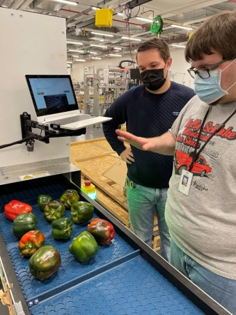
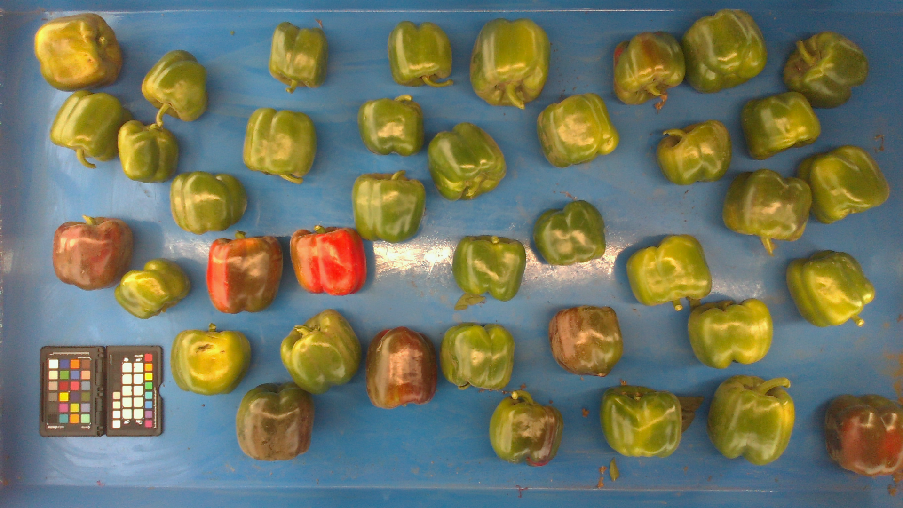

First step of Phenotyping is image capture. Few requirements of Image captures for vegetable phenotyping are:

**Lighting**: Proper lighting is essential for accurate phenotyping. It is best to use uniform, diffused light to avoid shadows and highlight any features that we want to measure or analyze.

**Resolution**: High-resolution images are important for accurately measuring and analyzing small features of the vegetables. A resolution of at least 1 megapixel (1000 x 1000 pixels) is recommended.

**Angle**: The angle at which the images are taken can affect the accuracy of phenotyping. It is best to take images from a consistent angle to ensure that measurements are accurate and comparable.

**Image quality**: The images should be clear and free from distortion or noise. This can be achieved by using a good quality camera and proper lighting.

**Image MetaData**: It is very useful to have required image metadata with relevant information such as the date, location, crop and any other relevant details. This can help with organizing and analyzing the images.

**Image storage**: It is important to store the images along with metadata in a secure and organized manner to ensure that they can be easily accessed and analyzed.

Currently we support vegetable phenotyping from two image capture systems

1. **ScaleCam**
2. **VIP (Vegetable Image phenotyping)**

<figure markdown>
  { width="400"}
  <figcaption>ScaleCam in Operation</figcaption>
</figure>

<figure markdown>
  { width="400" }
  <figcaption>ScaleCam Image</figcaption>
</figure>

<figure markdown>
  { width="400" }
  <figcaption>VIP Image</figcaption>
</figure>
