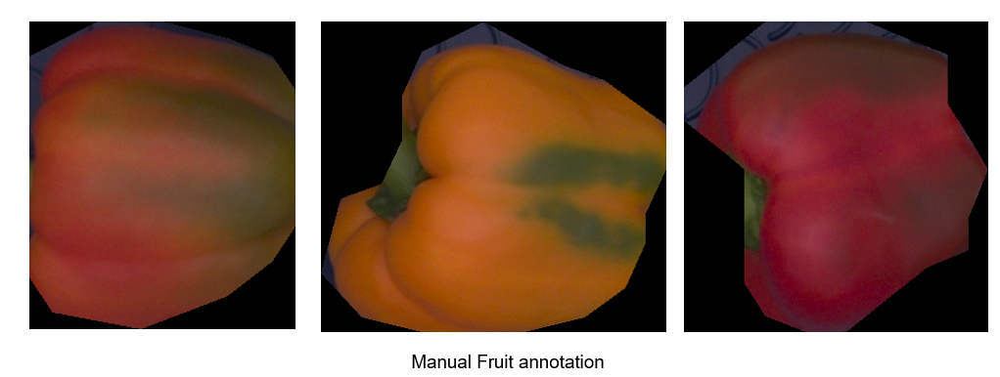
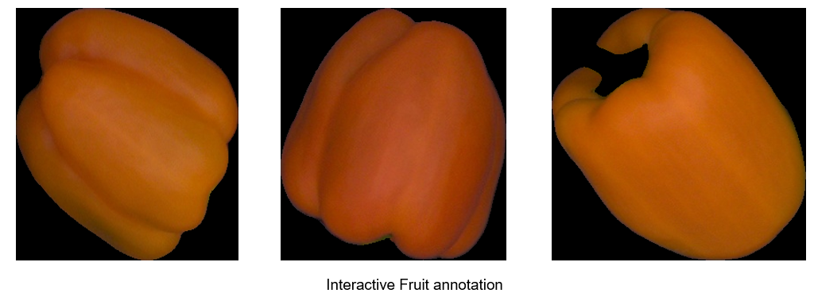

## **Interactive Annotation**:
Manual annotation takes a lot of effort specially for mask/polygon form of annotation. Also as annotators continue with the annotation work human error creeps in and the annotation are not very accurate. As an example see below the figure where edges of fruits are very well annotated it makes quite an impact for image based phenotyping where we are looking for mm/cm level accuracy.
<figure markdown>
  { align=left }
</figure>
Interactive annotation uses feedback from humans and speed up annotation via traditional computer vision algorithms like Grabcut or deep learning algorithms like [fbrs](https://arxiv.org/abs/2001.10331) our case.
In our case we were able to speed up the mask annotation of fruits from 8-10x while producing much more accurate segmentation. See the figure below

<figure markdown>
  { align=left }
</figure>
Below are some examples of live annotation using interactive annotation

<figure markdown>
  { align=left }
  <figcaption>Example of Peppers annotation</figcaption>
</figure>

<figure markdown>
  { align=left }
  <figcaption>Example of cucumbers annotaiton</figcaption>
</figure>

See [Interactive Anootation](https://github.com/bayer-int/Interactive_Annotation.git) for implmentation details and added modifications.