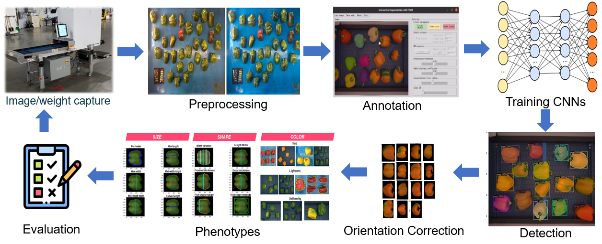

The process of image based Vegetable Phenotyping typically involves several steps:

1. **Image capture**: This involves taking pictures of the vegetables using a camera or other imaging device. The images should be taken under consistent lighting conditions to minimize variations in color and appearance.

    * **Camera calibration**: During this process images are calibrated by using checkerboard

    * **Color calibration**: The images are then color calibrated by using some fixed color reference

2. **Image annotation**: The images may need to be annotated, or labeled, in order to identify specific features or areas of interest. This can be done manually or using machine learning algorithms.

3. **Training CNNs**: Convolutional neural networks (CNNs) are trained to detect fruits and correct their orientation .

    * **Detection**: Instance segmentation netowrk is used to detect the fruits.

    * **Orientation correction**: To align the fruits along the same axis we develop a novel method to train a regression model to detect the points to align the fruits (patent pending please donot disclose) :fontawesome-solid-user-secret:

4. **Phenotype measurements**: Once all the frutis in the image are properly aligned, digital measurements can be taken to quantify the characteristics of the vegetables. These measurements could include things like size, shape, color, and texture.

5. **Validation**: The accuracy of the phenotypes measurements are validated by comparing them to ground truth data or other reference standards.

<figure markdown>
  { align=left }
  <figcaption>Digital Phenotyping Process from left to right and from top to bottom</figcaption>
</figure>

The following sections will go through each step of this proccess
