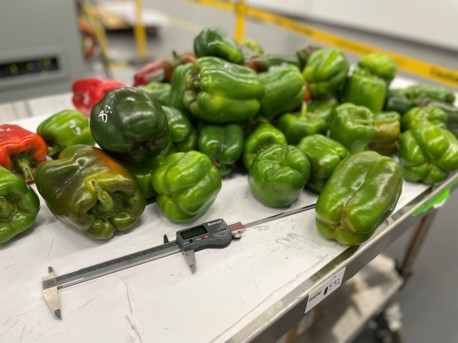

We can divide the validation process in three categories

1. **Image based Metrics**:
The Image based metrics is the first level of validation since the phenotypes are image based it is imprtant to make sure that these phenotypes are measured correctly on these images.
For this purpose we use several computer vision metrics during different process of image based phenotyping

    1. __Mean Average Precision (mAP)__
      Mean Average Precision (mAP) is a metric used to evaluate the performance of object detection and instance segmentation models. It is calculated by first computing the average precision for each class and then taking the mean of these values.
      To calculate average precision, we need to first determine the precision and recall for a range of different detection thresholds. The precision is the number of true positive detections (i.e., the number of instances of the class that are correctly detected) divided by the total number of detections (true positives plus false positives). Recall is the number of true positive detections divided by the total number of instances of the class in the dataset (true positives plus false negatives).
      We can then plot precision versus recall for each class and compute the area under the curve (AUC) to get the average precision for that class. Finally, we take the mean of the average precisions for all classes to get the overall mAP score.
      For instance segmentation, the mAP is calculated in a similar way, but instead of just considering whether the detection is correct, we also consider the overlap between the predicted segmentation and the ground truth segmentation. This overlap is typically measured using the Intersection over Union (IoU) metric. The mAP is then calculated using the mean IoU of all the true positive detections at different overlap thresholds.

    2. __Mean Square Error__
      Mean Squared Error (MSE) is a common metric  used in regression problems for example orientation keypoint detections for our case. It measures the average squared difference between the predicted output and the true output. In other words, it compares the differences between the predicted values and the actual values, squares them, and then takes the mean of all the squared differences.

2. **Manual Validation with real world metrics**:
    Second level of validation is manually comparing digital image based phenotypes with conventional phenotypes collected by breeders. It should be noted that not all the phenotypes, which can be calculated digitally can be measured manually easily few examples of this case is fruits perimter which is very hard to be measured manually another one can be resemeblence of fruit to a square or circle which can be very difficult for breeders or users to estimate objectively. Hence this kind of validation should be done carefully keeping in mind the human error and if it makes sense to comapre human rating with digital phenotypes. On the other hand some phenotypes make sense to compare, this will make sure that digital phenotypes are correct some examples of these phenotypes are width and length of fruits.

3. **Buissness Metrics**:

    1. **Repeatability**

      In vegetable phenotyping, repeatability refers to the ability to obtain consistent results when measuring the same vegetable trait(s) under the same conditions. It is an important consideration in vegetable phenotyping studies, as it allows breeders to accurately compare results across different experiments and to confirm the reproducibility of their findings.
      If the digital Image phenotyping is working well we expect this buissness metrix to be high.

<figure markdown>
  { align=left }
  <figcaption>Manual Validation Process</figcaption>
</figure>
